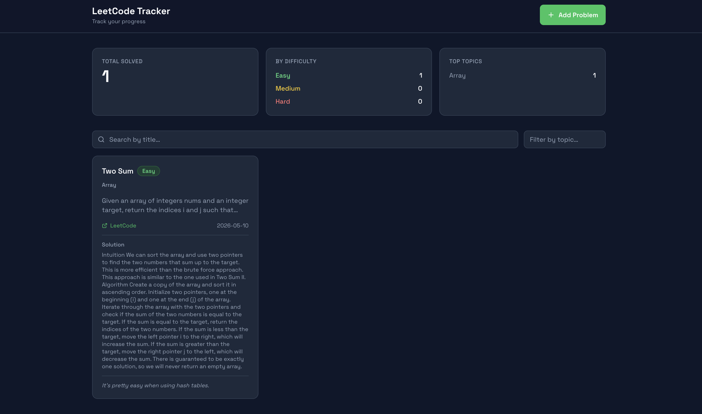
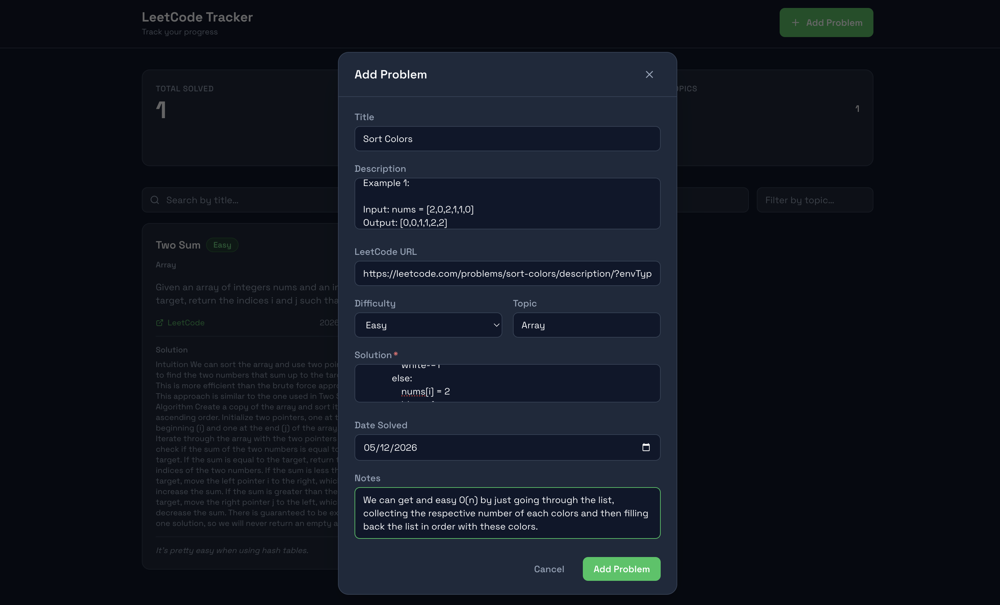
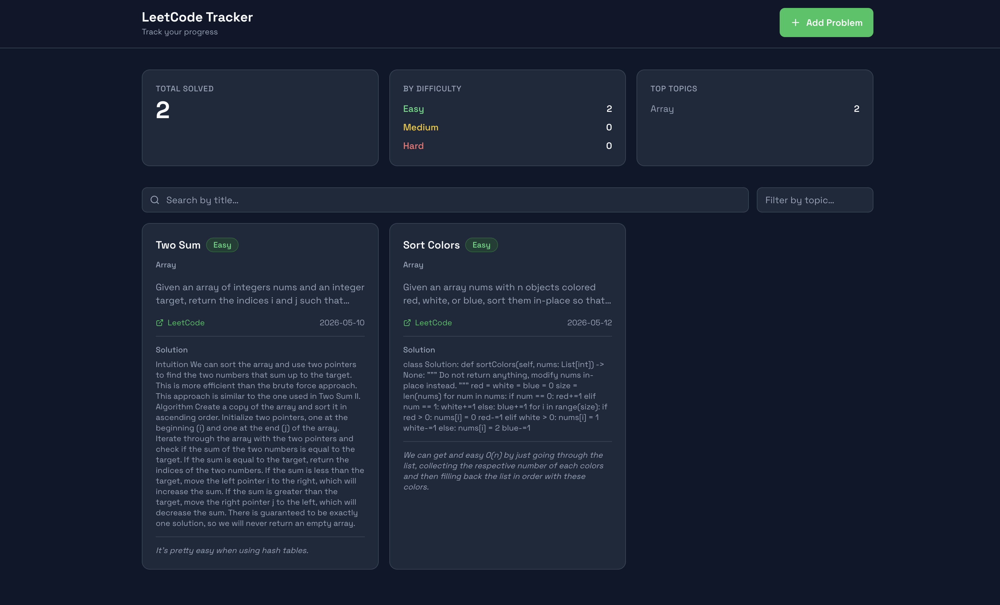

# LeetCode Tracker

**Live:** https://leet-code-tracker-5vvm.vercel.app

A personal progress tracker for LeetCode problems. Log each problem you solve, keep notes on your approach, and see how your practice is distributed across difficulties and topics over time.

---

## Motivation

Grinding LeetCode without a record makes it hard to know what you've actually covered, spot weak areas, or quickly demonstrate progress to others. This tracker gives you a structured log: every problem you solve goes in with its difficulty, topic, approach, and date. You can filter and search your history, see breakdowns by difficulty and topic, and share the dashboard with anyone you want.

---

## What it does

- **Log problems** — title, difficulty, topic, description, LeetCode URL, solution approach, date solved, and notes
- **Browse and filter** — search by title or filter by topic across your full history
- **Track stats** — total solved, breakdown by difficulty (Easy / Medium / Hard), and top topics; filterable by topic and date range
- **Edit and delete** — update your solution notes or difficulty after the fact, or remove a record entirely

---

## Screenshots

**Dashboard** — stats panel, filter bar, and problem cards



**Adding a problem** — modal form with all required fields



**After adding** — stats and list update immediately



---

## Stack

| Layer | Technology |
|-------|-----------|
| Backend | FastAPI, SQLAlchemy, PostgreSQL, Pydantic |
| Frontend | React 18, TypeScript, Vite, Tailwind CSS |
| Testing | pytest (backend), Vitest + RTL (frontend) |

---

## Project Structure

```
leetcode-tracker/
├── backend/          # FastAPI app, models, schemas, routes
│   └── tests/        # pytest suite (40 tests)
├── frontend/         # Vite + React + TypeScript UI
│   └── src/
│       ├── api/          # Fetch wrappers
│       ├── models/       # TypeScript types
│       ├── presenters/   # State hooks (MVP pattern)
│       ├── components/   # Pure UI components
│       └── __tests__/    # Vitest suite (60 tests)
└── docs/             # Testing plans and deeper references
```

---

## Getting Started

### Backend

**Prerequisites:** Python 3.10+, a running PostgreSQL instance.

```bash
cd backend
python -m venv .venv && source .venv/bin/activate
pip install -r requirements.txt
```

Copy `.env.example` to `.env` and fill in your credentials:

```bash
cp .env.example .env
# Edit .env: set DATABASE_URL, HOST, PORT, ENVIRONMENT
```

> If your database password contains special characters (`@`, `#`, `$`, etc.), URL-encode them — e.g. `@` becomes `%40`.

Start the server:

```bash
python main.py
```

The API runs at `http://localhost:8000` by default. Interactive docs are at `/docs`.

---

### Frontend

**Prerequisites:** Node.js 18+.

```bash
cd frontend
npm install
npm run dev
```

The dev server proxies to `http://localhost:8000` by default. To point it elsewhere:

```bash
# frontend/.env
VITE_API_URL=http://your-api-host
```

---

## API

| Method | Endpoint | Description |
|--------|----------|-------------|
| `GET` | `/problems/` | List problems. Filters: `title`, `topic`, `skip`, `limit` |
| `POST` | `/problems/` | Add a problem |
| `PUT` | `/problems/` | Update mutable fields: `difficulty`, `topic`, `solution`, `notes`, `dateSolved` |
| `DELETE` | `/problems/` | Delete a problem by title |
| `GET` | `/problems/stats` | Totals by difficulty and topic. Filters: `topic`, `start_date`, `end_date` |

Full request/response schemas are in [`docs/PLAN.md`](docs/PLAN.md).

---

## Tests

**Backend** — from `backend/`:

```bash
pytest tests/ -v
```

**Frontend** — from `frontend/`:

```bash
npm test
```

---

## Docs

| File | Contents |
|------|----------|
| [`docs/PLAN.md`](docs/PLAN.md) | Project design, API spec, and stretch goals |
| [`docs/BACKEND_TESTING.md`](docs/BACKEND_TESTING.md) | Per-test breakdown for the backend suite |
| [`docs/FRONTEND_TESTING.md`](docs/FRONTEND_TESTING.md) | Per-test breakdown for the frontend suite |
| [`docs/General_Testing_Plan.md`](docs/General_Testing_Plan.md) | Overall testing strategy and known gaps |
